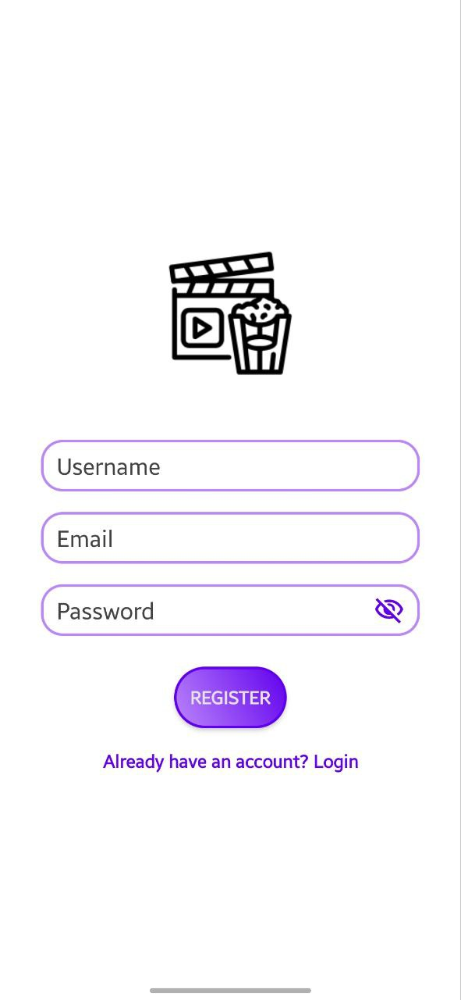
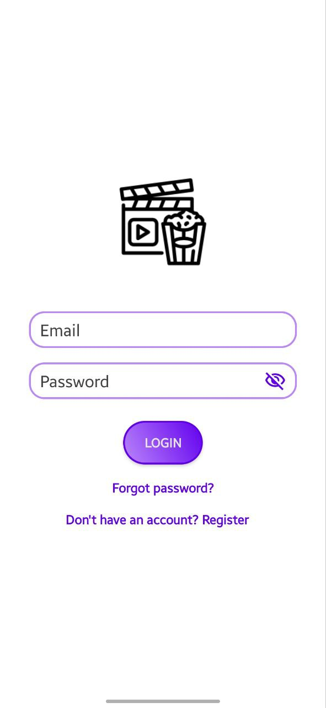
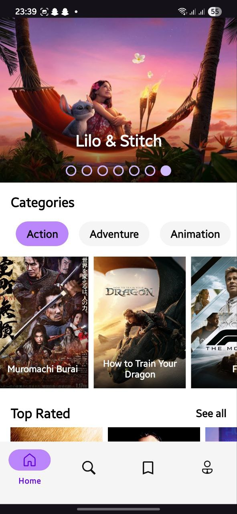
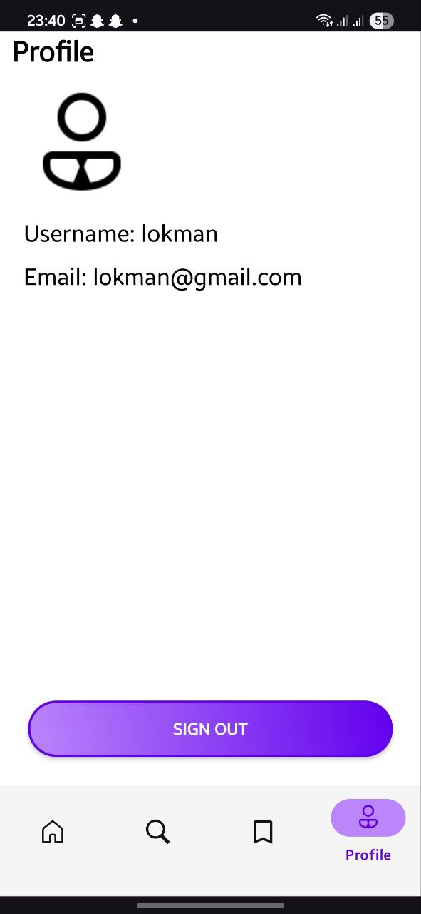

# Movify App
Here are some screenshots showcasing Movify in action:

<table style="width:100%; border-collapse: collapse;">
<tr>
<td style="text-align: center; padding: 10px;">

Splash Screen

</td>
<td style="text-align: center; padding: 10px;">

Register Screen

</td>
<td style="text-align: center; padding: 10px;">

Login Screen

</td>
</tr>
<tr>
<td style="text-align: center; padding: 10px;">

Home Screen

</td>
<td style="text-align: center; padding: 10px;">

Search Screen

</td>
<td style="text-align: center; padding: 10px;">

Saved Movies Screen

</td>
</tr>
<tr>
<td style="text-align: center; padding: 10px;">

User Profile Screen

</td>
<td style="text-align: center; padding: 10px;">

Movie Details Screen

</td>
<td style="text-align: center; padding: 10px;">

Similar Movies List

</td>
</tr>
</table>

## About Movify

Movify is a modern mobile application designed to enhance your movie-watching experience. It allows users to discover new movies, manage their watchlists, and share their opinions through ratings and reviews. Built with a focus on user experience and robust backend integration, Movify aims to be your go-to companion for all things cinema.

This project was developed as part of my internship with InternIntelligence.

## Features

Movify comes packed with the following key functionalities:

- **User Authentication:** Secure email/password authentication powered by Firebase Authentication.
    
- **Personalized Watchlist & Data Storage:** Users can save movies to their personal watchlists, along with their custom ratings and reviews. All user-specific data is securely stored using Firebase Firestore.
    
- **Content-Based Recommendation System:** Discover new movies tailored to your tastes! Movify implements a content-based filtering algorithm leveraging the "recommendations" endpoint of The Movie Database (TMDB) API to suggest similar movies based on your viewing history and preferences.
    
- **Review and Rating System:** Share your thoughts! Users can easily leave detailed reviews and assign ratings to movies. These reviews and ratings are stored in Firebase Firestore and are displayed prominently for each movie.
    
- **Movie Search & Discovery:** Search for any movie by title and instantly get detailed information.
    
- **Similar Movies Exploration:** On the movie detail screen, easily find and explore movies similar to the one you're currently viewing, expanding your discovery.
    

## Technologies Used

- **Frontend:** 
	- Android Studio / Kotlin ,XML 

- **Backend/Database:**
    - Firebase Authentication (Email/Password)
    - Firebase Firestore
        
- **APIs:**
    - The Movie Database (TMDB) API for movie data and recommendations.

        
- **Other Libraries/Tools:**
- [ Retrofit2,
-  Glide,
-  navigation,
-  viewpager2,
-  com.tbuonomo:dotsindicator:5.1.0
-  okhttp3 ]
    

## Architecture

Movify is developed following the **MVVM (Model-View-ViewModel)** architectural pattern. This approach ensures a clear separation of concerns, making the codebase more modular, testable, and maintainable.

**Important Note:**
- Before running the app, ensure you have set up your **Firebase project** and obtained a **TMDB API key**, and replaced them in the appropriate configuration files within the project.

>    Update the ApiKey in the "com.example.Movify.model.RetrofitClient" to your OWN API key .

